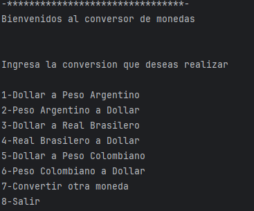
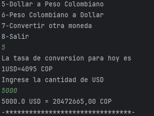
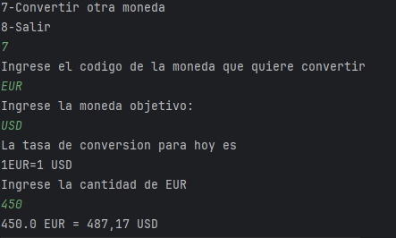
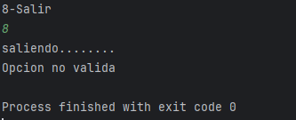

# Convertidor de divisas :tw-1f4b0: :tw-1f4b0: :tw-1f4b0:

Desafio conversor de monedas

- Configuración del Ambiente Java;
- Creación del Proyecto;
- Consumo de la API;
- Análisis de la Respuesta JSON;
- Filtro de Monedas;
- Exibición de Resultados a los usuarios;

###Descripcion

Construccion de mi propio Conversor de Monedas, realizando solicitudes a una API de tasas de cambio en este caso,
https://www.exchangerate-api.com/
manipular datos JSON y finalmente a filtrar y mostrar las monedas de interés del usuario.

#### Imagenes de ejemplo con la respuesta

##### Imagen Nuestro Menu

##### Imagen Respuesta conversor 

##### Imagen Respuesta otra divisa del menu

##### Imagen Salida conversor

